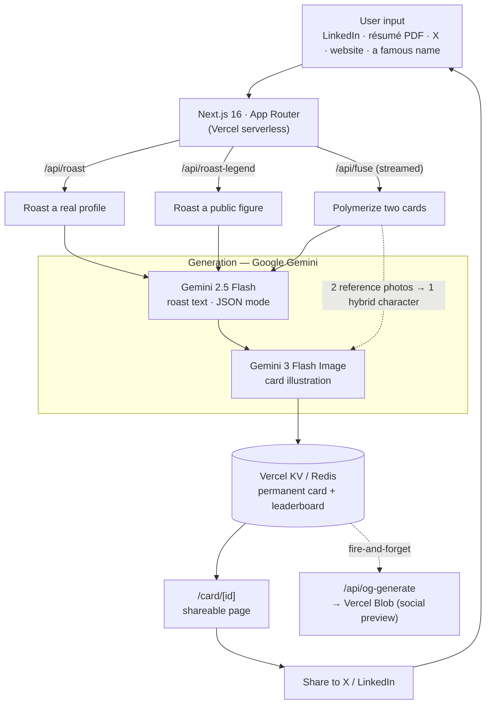

# PM Roast

**A brutally honest AI career coach for product managers — and a working generative-media product.**
Paste a LinkedIn/résumé/X handle (or just a famous name), get a Pokémon-TCG-style trading card: a roast, a PM archetype, an AI-illustrated likeness, and a shareable link.

🔗 **Live:** [pmroast.com](https://www.pmroast.com)

---

## TL;DR

PM Roast looks like a party trick, but under the hood it's a **multimodal generative-media pipeline**:

- **Text generation** turns a sparse profile into a scored, structured roast (archetype, moves, gaps, roadmap).
- **Image generation** turns a photo into an identity-consistent trading-card illustration — and in **Fusion Lab**, conditions on *two* photos to blend two people into one coherent hybrid character.
- Everything becomes a **permanent, shareable card** with a pre-rendered social preview, wired into a one-tap viral loop.

The interesting engineering is less "call an LLM" and more **making generative media reliable, fast enough for a web request, identity-consistent, and safe** — plus surviving the fact that hosted models get renamed and retired underneath you.

---

## Architecture



---

## How it works

### 1. Roasting a profile (`/api/roast`)
1. Input is normalized to text — a PDF is parsed, a LinkedIn/website/X profile is scraped, or the user pastes it. A "dream role" is selected.
2. **Gemini 2.5 Flash** returns a strict-JSON roast: archetype, 2 "moves," a 0–99 career score, gap analysis, a 4-month roadmap, and a screenshot-worthy "banger" quote — all framed around the *gap* to the dream role.
3. **Gemini 3 Flash Image** illustrates the card. With a photo it preserves the person's likeness in a comedic scene; without one it falls back to an original "creature."
4. The result is stored in **Vercel KV** and returned with a permanent `cardId`. A social-preview image is rendered to **Vercel Blob** in the background.

### 2. Fusing two cards — "Polymerization" (`/api/fuse`)
The showcase feature. Pick two Mt. Roastmore legends (or your own card) and merge them:
- A **deterministic element-fusion matrix** decides the hybrid's type; a stat formula makes fusions feel powerful.
- **Gemini 2.5 Flash** writes a hybrid archetype that references *both* people.
- **Gemini 3 Flash Image** is given **both reference photos at once** and asked to synthesize a *single believable person* carrying features of each — multi-image conditioning, not a collage.
- The endpoint **streams NDJSON stage events** (`analyze → text → image → store → done`) so the UI shows the live pipeline while you wait.

---

## Tech stack

| Layer | Choice |
|---|---|
| Framework | Next.js 16 (App Router), TypeScript, Turbopack |
| UI | Tailwind CSS v4, Shadcn/UI, Framer Motion |
| Text model | `gemini-2.5-flash` (JSON mode) |
| Image model | `gemini-3.1-flash-image` (single- & multi-image conditioning) |
| Card storage | Vercel KV (Redis) — permanent URLs + a leaderboard sorted set |
| Social previews | Vercel Blob (pre-rendered OG images) |
| Hosting | Vercel serverless functions (`maxDuration = 60`) |

---

## Key technical decisions (and why)

**One image model, defined once.** Hosted Gemini models get renamed and retired without warning — a retired image model once silently blanked every card, and a retired text model 500'd every legend roast. The image model now lives in a single `IMAGE_MODEL` constant (`src/lib/image-generation.ts`); a future retirement is a one-line fix, and `CLAUDE.md` carries a runbook for spotting it.

**`maxDuration = 60` on every generation route.** A roast is a ~20–45s text-plus-image request. Vercel's default function timeout (~15s) would kill it *after* the model work — a true silent failure. Raising the ceiling (and trimming in-code image timeouts to 45s) keeps the request inside the budget.

**Streaming the fusion pipeline (NDJSON).** A fusion takes ~20–30s. Rather than spin a generic loader, `/api/fuse` emits a stage event as each real step completes, and the client renders a live stepper naming the model/technique at each stage. The progress is *actually* server-driven, not faked.

**Identity-consistent image generation.** The hard part of the product isn't making an image — it's making it recognizably *you*. Prompts push hard on likeness preservation, and Fusion Lab pushes further: two input images → one coherent hybrid face. This is the exact "identity consistency across inputs" problem generative-media teams care about.

**Two models, split by job.** Text (`2.5-flash`, JSON mode) and image (`3.1-flash-image`) are separate calls. JSON mode guarantees parseable output, and the token budget is set high enough that the model's *thinking* tokens don't truncate the reply (an early bug). Keeping them separate means an image failure degrades gracefully to a text-only card instead of failing the whole roast.

**Permanent cards in KV + pre-rendered OG in Blob.** Cards need durable, shareable URLs and rich social previews. KV gives each card a stable `/card/[id]`; the OG image is generated once (fire-and-forget) and served from Blob, so a shared link unfurls instantly without re-running a model.

**Responsible by design.** No text is baked into generated images (AI text always looks wrong); roasts target the role/résumé, never attack by name; public figures use public info only; uploaded photos are used to generate one card, not retained.

---

## Local development

```bash
npm install
cp .env.example .env.local   # add GEMINI_API_KEY, KV + Blob tokens
npm run dev                  # http://localhost:3000
npm run build                # production build
npm test                     # unit tests
```

See [`CLAUDE.md`](./CLAUDE.md) for the full architecture reference, API-route contracts, the card/rarity system, and the Mt. Roastmore card pipeline.
